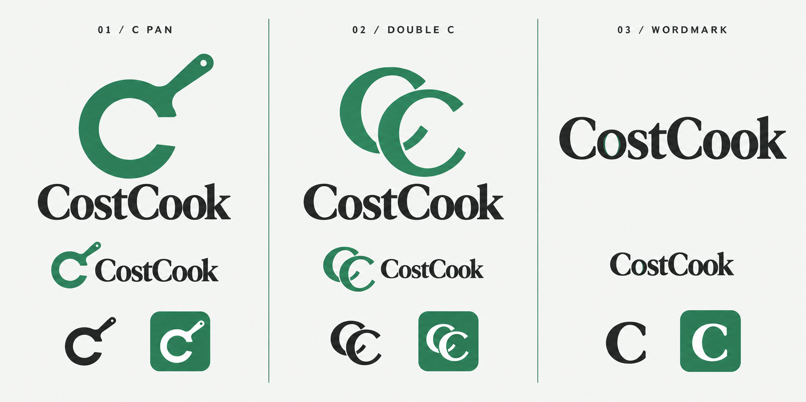

<!-- story: docs/stories/logo-concepts.story.md -->
# CostCook logo directions

The existing green and serif pairing suits the site. My concern is the symbol: its horizontal bar can make it read as a G, while the small amber diamond contributes little at navigation size.

1. **C pan:** a C that doubles as a pan. My preferred direction because it connects the initial to cooking directly.
2. **Double C:** a compact monogram with a more formal feel; less explicitly culinary.
3. **Wordmark:** the quietest option, with a subtle plate-like o; the detail is less visible in the small rendition.

These are AI-generated concept previews, not final vector assets. The selected direction still needs consistent vector geometry and actual 16/24/32-pixel checks. The generated board contains slight texture and variation between renditions; those are not specifications for production. The site has not been changed.

## Research

[Adobe: What makes a great logo](https://helpx.adobe.com/in_hi/illustrator/how-to/great-logo-design.html) recommends legibility across sizes, streamlined shapes, brand relevance, iteration, and vector artwork.

[Adobe: Minimalist logo design](https://www.adobe.com/uk/creativecloud/design/discover/minimalist-logo-design.html) recommends reducing unnecessary detail and judging designs in black and white before relying on colour.

## Generation record

Tool: built-in image generation. Final asset: `costcook-directions.png`.

Prompt brief: create a three-column CostCook identity board, labelled 01 / C PAN, 02 / DOUBLE C, and 03 / WORDMARK; preserve forest green, dark ink, pale offwhite, and a warm Fraunces-inspired serif; compare a C-shaped pan, CC monogram, and a wordmark with a subtle plate detail; include smaller, monochrome, and reversed renditions; avoid gradients, chef hats, brains, and currency signs.

Final edit prompt: replace the transparent background with opaque offwhite #f4f6f4 while preserving the designs, labels, colours, and layout.

Focused UI scope: brand recognition on landing and shared marketing pages; header/footer identity frame; home navigation action. Inspected BrandLockup, its SiteNav/SiteFooter consumers, favicon SVG, and the existing desktop QA screenshot. No route or workflow restructuring is needed. No implementation or live browser regression testing was performed for these concept images.
